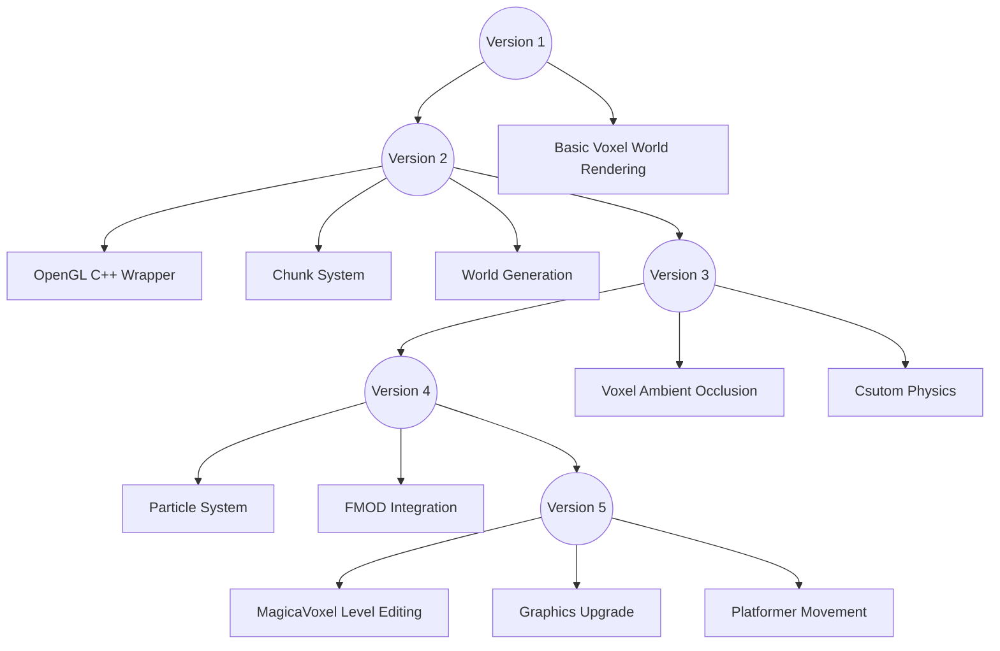

**This is one of my early projects.**
{: .notice--danger}

Check [this GitHub repo](https://github.com/andyroiiid/voxel-game-binaries) for engine/game builds.
{: .notice--info}

A **multi-threaded** Minecraft-like **voxel** game engine with **infinite world** support, and a **plaforming** game made with the engine.

## Highlights

### Features

- Modern OpenGL renderer (4.6 Core Profile, Direct State Access)
- Infinite voxel world support
- Multi-threaded chunk update
- Custom voxel map physics
- FMOD integration
- Use [MagicaVoxel](https://ephtracy.github.io/) for level editing

### Quirks

- Requires AVX2 instruction set support for SIMD
- Might not work with Intel integrated graphics because [their drivers have problems with Direct State Access](https://blog.magnum.graphics/announcements/2020.06/#certain-gl-drivers-continue-to-be-a-hot-mess)

## Demo videos

### Voxel Platforming Game Demo



### Basic Block Editing Demo



## Play Instructions

```
return to main menu: esc
```

### FreeFall mode

```
horizontal movement: WASD
jump: space
interact: left click
orange blocks are save points
green blocks unlocks the red blocks
blue/pink blocks can switch on/off blocks of corresponding color
```

### Playground mode

```
horizontal movement: WASD
ascend: Q
descend: E
destroy block: left click
create block: right click
```

## Engine Version History



### Version 1: Voxel rendering

Version 1 was created a long time ago and I lost the source files for this version.

It was just some **basic voxel world rendering** written with the [magnum](https://github.com/mosra/magnum) framework.

### Version 2: Chunk-based world

One of the biggest goal of this project for me was to learn modern OpenGL, so I decided to drop other frameworks and write my own OpenGL wrapper.

This version supports:

- **Infinite** voxel world support
  - Instead of Minecraft-like 16x16x256 chunk, I chose 32x32x32 chunk (Now I know this is a dumb choice)
- Multi-threaded chunk update
  - **Worker threads** for chunk updating and voxel face culling
  - Main thread for uploading to GPU
- **Perlin noise** based world generation

#### A small story about STL and cross-platform consistency

Back then I used [a Perlin noise library](https://github.com/Reputeless/PerlinNoise) for world generation, but when I tested it on multiple platforms, the **same** seed generates **different** worlds.

- World A
  - Windows + MinGW GCC
  - Linux + GCC
- World B
  - Windows + MSVC

Since the library is the same, there must be something wrong with the standard library. At first I thought maybe `std::mersenne_twister_engine` would behave differently on different platforms, but that wasn't the case. The real bug was from [`BasicPerlinNoise::reseed()`](https://github.com/Reputeless/PerlinNoise/blob/9de88a9a6f45938485b3301480f15b565e7d040b/PerlinNoise.hpp#L125)

As you may know, Perlin noise algorithm has a bootstrap step which involves **shuffling** an array. Back when I was writing Version 2, this function looks like this:

```c++
std::shuffle(std::begin(p), std::begin(p) + 256, std::default_random_engine(seed));
```

However, `std::shuffle` is implemented differently in GCC and MSVC! If you take a look at the standard libraries source code of those two compilers, they both use [the Knuth shuffle algorithm](https://en.wikipedia.org/wiki/Fisher%E2%80%93Yates_shuffle), but there are [two variants](https://en.wikipedia.org/wiki/Fisher%E2%80%93Yates_shuffle#The_modern_algorithm)(iterating forward and backward), which produce different results.

So the solution was obvious for me: I wrote my own `shuffle()`.

That Perlin noise library has [fixed](https://github.com/Reputeless/PerlinNoise/blob/master/PerlinNoise.hpp#L453) it now: `perlin_detail::Shuffle(m_permutation.begin(), m_permutation.end(), std::forward<URBG>(urbg));`
{: .notice--info}

I have absolutely no idea why I didn't submit a pull request back then.
{: .notice--info}

I began to use [RenderDoc](https://renderdoc.org/) to debug my graphics code in this version, which was a great tool.


### Version 3: Fake Ambient Occlusion & Custom Voxel Physics

In this version, I implemented a [fake ambient occlusion](https://iquilezles.org/articles/voxellines/) effect. This technique was too verbose to set up and introduces tons of problems when generating chunks (it requires accessing neighbouring chunks frequently, which is a huge pain for multi-threading). I didn't migrate it to the next version.

It looked nice, though.


{: .align-right}

The physics engine is a simple custom one written from scratch. I didn't have any experience implementing a physics engine before. So it doesn't contain any fancy stuff like broad/narrow phases, and it only supports collision detection and ray-casting.

The character controller is a [**kinematic controller**](https://nvidia-omniverse.github.io/PhysX/physx/5.1.2/docs/CharacterControllers.html#kinematic-character-controller) with an AABB collider. It used **preventive collision detection** (try to stop the object before colliding) with **binary search**, which wasn't a very great choice. Now I know there are other ways (like allowing objects to penetrate each other and fixing those later), but it worked well enough for me back then.

Also, starting from this version I began to use [Tracy](https://github.com/wolfpld/tracy) to monitor the game performance.


### Version 4: The Game

At this point the engine is basically capable of making a game, so I started to make a Minecraft clone with stuff like **infinite caves**, **mining**, **crafting equipments**, etc.



As you've probably noticed, soon I realized that I'm not a great artist.
{: .notice--success}

I also got some nice features working:

- Flipping textures randomly to break patterns (See the 3rd image in the gallery above)
- GPU controlled particles
- FMOD integration

My version of GPU particles was very simple. basically I was using an old technique called [Point Sprite](https://www.khronos.org/opengl/wiki_opengl/index.php?title=Point_Sprite&redirect=no):

1. Set particles base location in uniform data
2. `glEnable(GL_PROGRAM_POINT_SIZE);`
3. Vertex shader: generate random movement with the `gl_VertexID` or `gl_InstanceID` and set `gl_PointSize` depending on the distance to the camera
4. Fragment shader: use `gl_PointCoord` as texture uv
5. `gl_DrawArrays(GL_POINTS, 0, particleNum);` or `glDrawArraysInstanced(GL_POINTS, 0, particleNum, instanceNum);`

I managed to get some sort of gameplay working, but it just didn't feel very great, so I started to consider something else.

### Version 5.0: Free Fall

I've been a fan of platforming games, so I started to make one myself. This time it worked much better and I got tons of interesting stuff working.


#### Skybox

I got the procedural skybox from [glsl-atmosphere](https://github.com/wwwtyro/glsl-atmosphere) working and made a **dynamic day-night system** around it.

#### Distance attenuation (fog)

As the game map grew bigger, I realized that it was hard to tell the distance with flat lighting, so I added a simple fog to the game:



#### Level Editing

The level editor was actually a voxel modelling tool called [MagicaVoxel](https://ephtracy.github.io/). It's a great tool and I've been playing with it for a while, so I started to consider using it as a level editing tool.

After studying the [`.vox` file format](https://github.com/ephtracy/voxel-model/blob/master/MagicaVoxel-file-format-vox.txt), I wrote a **parser** to convert it into my own level format.

- Different color palette indices are mapped to different block types
- There are extra config files for entities (doors, buttons, checkpoints, etc.)


### Version 5.1: A New Look

After a while I decided that [Kenney's textures](https://www.kenney.nl/) was too dark (muddy?) with the fog, so I made a new minimalistic texture set myself.


This time I polished the platforming code and added stuff like **coyote-time** to the character controller.

### Version 5.2: More game entities

This is the final version. I added more gameplay elements to the game.

This version also supports emissive textures (those icons on the blocks).


