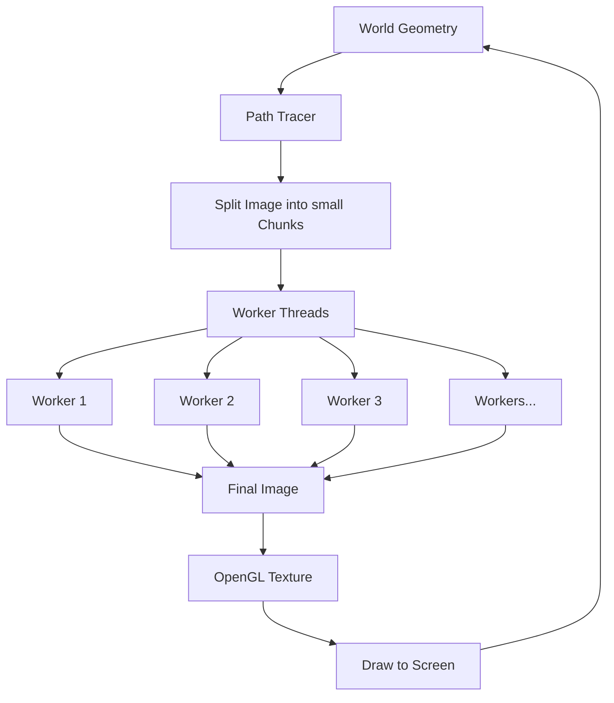

**This is one of my early projects.**
{: .notice--danger}

## Demo video



## Brief Description

The core algorithm is based on the famous [Ray Tracing in One Weekend](https://raytracing.github.io/) tutorial.

I wanted to play around with the algorithm so I added stuff like **multi-threading** and **OpenGL interactive display** to it.

## Pipeline

TraceR has a very simple pipline since OpenGL is only responsible for displaying the image.

## Splitting Workload for Multi-threading

### Fork-Join Model

At first I simply splited the image into a few large areas and assigned each to a thread ([fork-join model](https://en.wikipedia.org/wiki/Fork%E2%80%93join_model)).

For example, if I have 4 worker threads, I can simply cut the image into 4 areas:

- top left
- bottom left
- top right
- bottom right

and assign them to each thread.

I soon realized this is a bad design: Some areas (mainly geometry/bounce heavy) might take **much longer (more than 10x)** to render comparing to others (mainly sky, for example).

### Producer-Consumer Pattern

Fork-join model is a good model, provided that the workload is split evenly, which is not the case in my program. So I had to turn to another pattern: [Producer-Comsumer](https://en.wikipedia.org/wiki/Producer%E2%80%93consumer_problem).

Usually when implementing Producer-Cosumer pattern there will be lots of synchronization primitives flying around, but in this program it's pretty simple, as the workload doesn't overlap with each other (image areas have very clear boundaries). The only place I need synchronization for is **the job queue**.

I simply add a mutex to the job queue because there's no need to sleep/wake workers (they are always working till they finish and destroy themselves). Then I put each row of the image into the job queue. It worked nicely.
