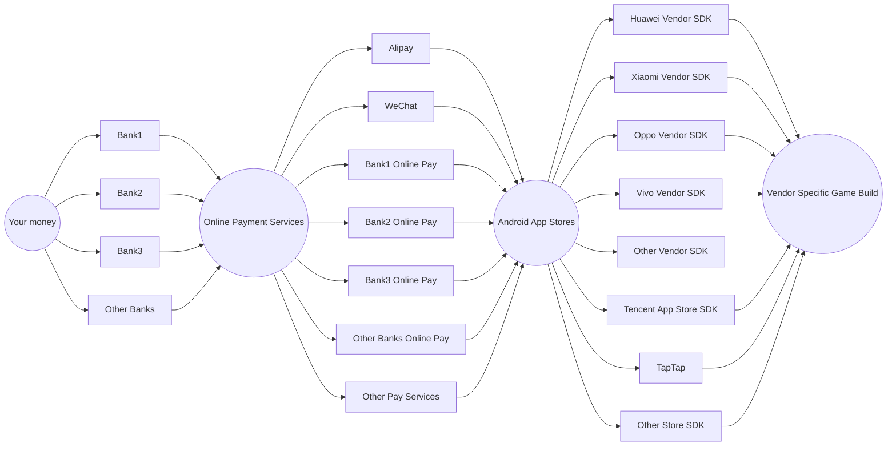

As you probably know, China has a *very weird* Android ecosystem since we don't have anything like Google Play Store, so almost every smartphone vendor has their own Android market, with their own SDKs. You **have** to integrate those SDKs.

Also unlike in United States where a credit card can handle almost everything, we have banks, Alipay, WeChat, and other small services and normally we don't pay directly from our bank accounts.

So the whole chain looks like this:

Imagine making a build for each smartphone brand and having developers to maintain and test those builds.
{: .notice--success}

As a result we had amalgamated payment SDKs (chinese name: 聚合支付). *One SDK to rule them all*.

Then it turned out smartphone vendors didn't like those amalgamated SDKs for whatever reasons and sometimes they even forbid the use of those SDKs.
