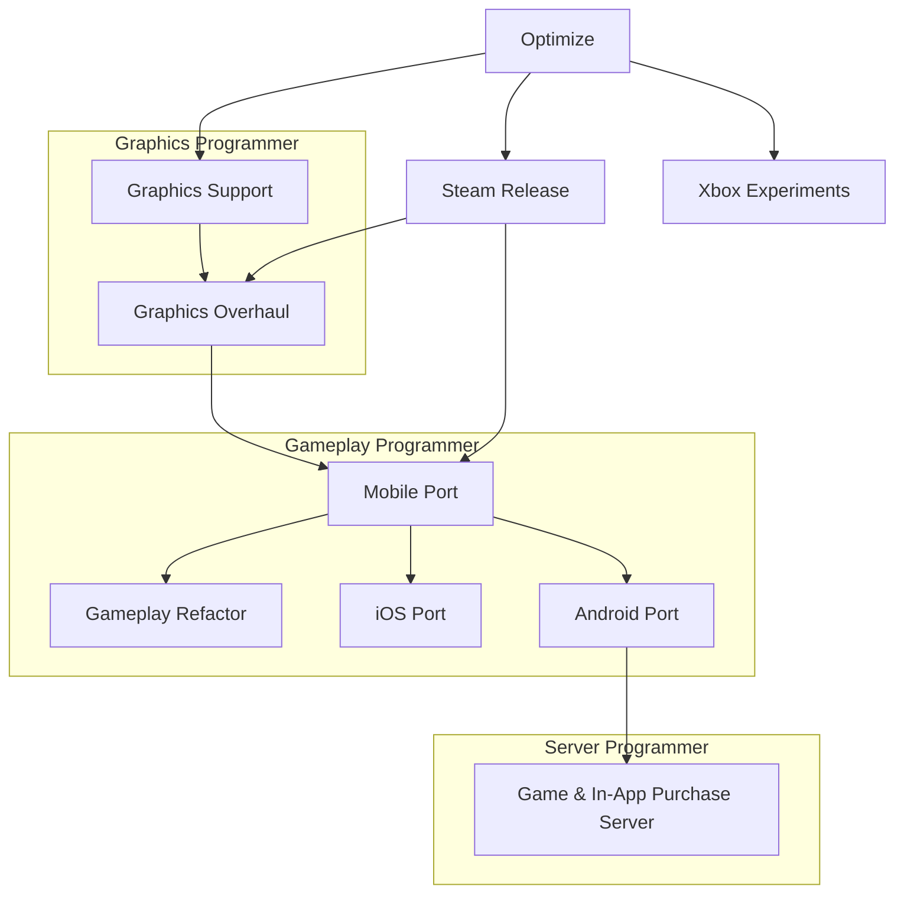

## Gameplay Trailer (Steam version)



## Game Description

This is a 3D puzzle/action game focusing on polymorphing maps. Shipped on [Steam](https://store.steampowered.com/app/601120/Brain_Machine/), [App Store](https://apptopia.com/ios/app/1208346401/about), and [Chinese Android stores](https://www.taptap.cn/app/67060).

## My Responsibilities

This is my **first** project as a game programmer. We were a small team, so I had to **grow quickly** and pick up **all kinds of responsiblities**.

Here's a flowchart of the most roles I took:

At the beginning I didn't know much about the game, but I got some experience with Unity and OpenGL (and shaders). My first task was **maintaining the PC build**. Unity has a very mature pipeline, so my major resposibility was simply to watch and make sure nothing goes wrong. I also got the chance to study every parts of the game.

Later as I became a better game programmer and knew more about the project, I began working as a **Graphics Programmer** and helped the artists making new animations, models, and materials. I **wrote shaders with ShaderLab** and **made some VFX**.

After the game released on Steam, we continued to prepare for an iOS release. I was one of the only two developers with a Mac™ device so naturally I became a **Gameplay Programmer** when we found that we need to add a whole new system for touch screen support.

Yes, we were a small team so we had to BYOD.
{: .notice--success}
Yes, I was using a MacBook Pro with a mid-tier AMD GPU back then, which wasn't a great choice for making games.
{: .notice--success}
Yes, technically the game also runs on macOS. I believe I also made a build for Linux, but we never had plans to release on those platforms.
{: .notice--success}

The last platform we released on was Android, which became a whole new story, I'll talk about that [here](/anecdote/anecdote-releasing-an-android-game-in-china).

Anyway, we had to develop a game server to handle things like **purchasing and game cloud saves**. Again, as the only devloper with some knowledge on web services, I became a **Server Programmer**, **wrote our game server with Flask**, and **integrated with all kinds of purchasing services**.

## Gallery


